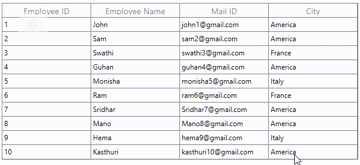

# How to customize the shift and arrow key selection behavior in WPF DataGrid (SfDataGrid)?

## About the sample
This example illustrates how to customize the shift and arrow key selection behavior in WPF DataGrid (SfDataGrid)?

In [SfDataGrid](https://help.syncfusion.com/cr/cref_files/wpf/Syncfusion.SfGrid.WPF~Syncfusion.UI.Xaml.Grid.SfDataGrid.html), when selection making by pressing Shift key and Left arrow or Right arrow in editing process. This make editor control text selection. This is a behavior of Editor control. In this behavior can be customized in PreviewKeyDown event in based on column renderer. [GridTextBoxColumn](https://help.syncfusion.com/cr/cref_files/wpf/Syncfusion.SfGrid.WPF~Syncfusion.UI.Xaml.Grid.GridTextColumn.html) customizing by using the [GridCellTextBoxRenderer](https://help.syncfusion.com/cr/cref_files/wpf/Syncfusion.SfGrid.WPF~Syncfusion.UI.Xaml.Grid.Cells.GridCellTextBoxRenderer.html). 

```C#
this.sfdatagrid.CellRenderers.Remove("TextBox");
this.sfdatagrid.CellRenderers.Add("TextBox", new GridCellTextBoxRendererExt(sfdatagrid));

public class GridCellTextBoxRendererExt : GridCellTextBoxRenderer
{
        public SfDataGrid grid;

        public GridCellTextBoxRendererExt(SfDataGrid sfDataGrid)

        {
            grid = sfDataGrid;
        }

        public override void OnInitializeEditElement(DataColumnBase dataColumn, TextBox uiElement, object dataContext)
        {
            base.OnInitializeEditElement(dataColumn, uiElement, dataContext);

            uiElement.PreviewKeyDown += UiElement_PreviewKeyDown;
        }

        private void UiElement_PreviewKeyDown(object sender, KeyEventArgs e)
        {
            if (Keyboard.IsKeyDown(Key.RightShift) || Keyboard.IsKeyDown(Key.LeftShift))
            {
                if (e.Key == Key.Right)
                {
                    grid.SelectionController.CurrentCellManager.EndEdit();
                    RowColumnIndex rowcol = new RowColumnIndex(this.grid.SelectionController.CurrentCellManager.CurrentRowColumnIndex.RowIndex, this.grid.SelectionController.CurrentCellManager.CurrentRowColumnIndex.ColumnIndex + 1);
                    grid.MoveCurrentCell(rowcol, false);
                }
                else if (e.Key == Key.Left)
                {
                    grid.SelectionController.CurrentCellManager.EndEdit();
                    RowColumnIndex rowcol = new RowColumnIndex(this.grid.SelectionController.CurrentCellManager.CurrentRowColumnIndex.RowIndex, this.grid.SelectionController.CurrentCellManager.CurrentRowColumnIndex.ColumnIndex - 1);
                    grid.MoveCurrentCell(rowcol, false);
                }

                e.Handled = true;
            }
        }
}

```

[SfDataGrid](https://help.syncfusion.com/cr/cref_files/wpf/Syncfusion.SfGrid.WPF~Syncfusion.UI.Xaml.Grid.SfDataGrid.html) provides support for various built-in column types. Each column has its own properties and renderer for more details please refer the below documentation link.

**Documentation Link:** https://help.syncfusion.com/wpf/datagrid/column-types



## Requirements to run the demo
Visual Studio 2015 and above versions

